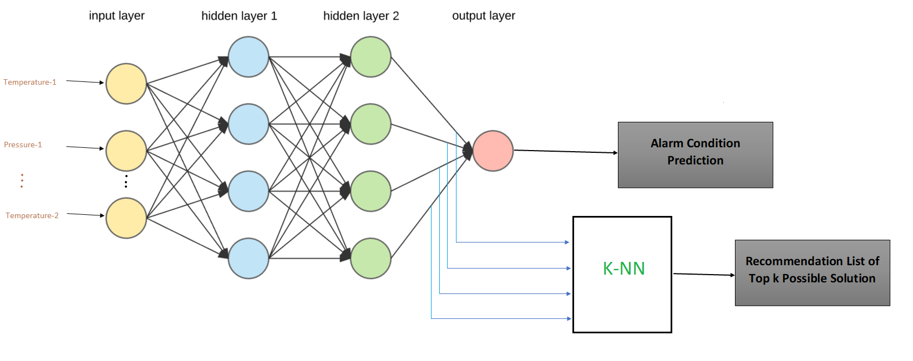

# Working Model

# Usecase

You can work with two different solution for same problem:

1. tensorflow code
2. keras code

## Tensorflow based

Nodejs server can be run via command 

    node indexPythonSTD.js
    
in "prediction-recommendation-DNN-KNN/FinalProjectNodeJSServer/4-InputSensor/Server code/"

and your server is up and running

## Keras based

Nodejs server can be run via command 

    node app.js
    
in "prediction-recommendation-DNN-KNN/FinalProjectNodeJSServer/4-InputSensor/Keras Solution/Server code/"

and your server is up and running
