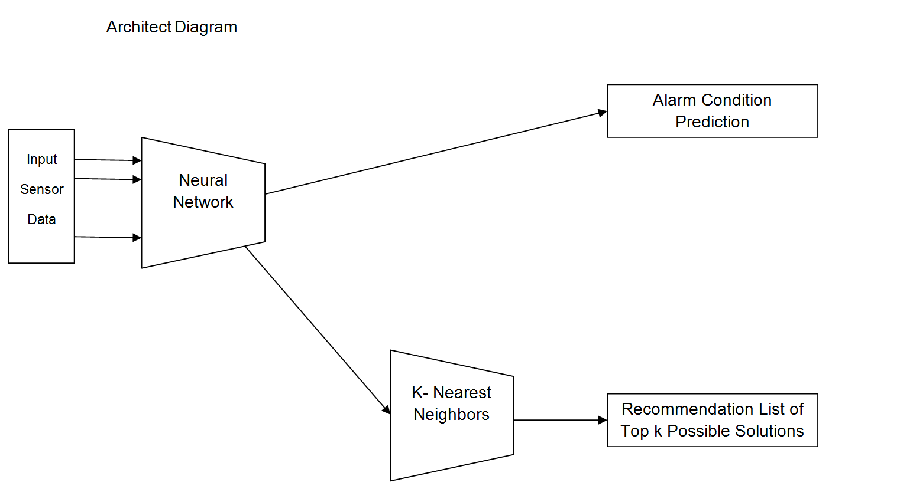
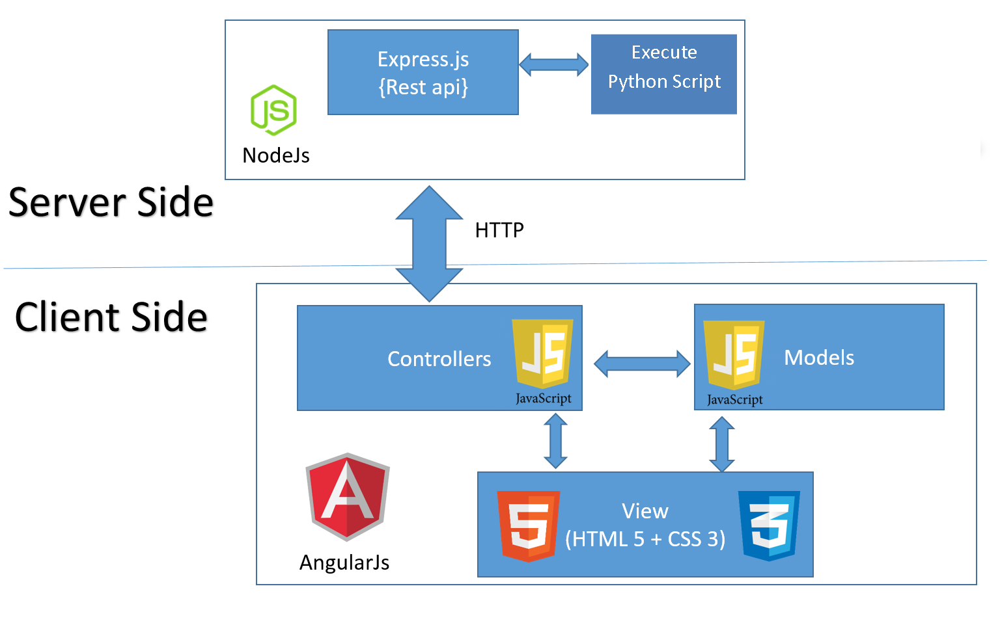

# prediction-recommendation-DNN-KNN
A prediction and recommendation system for recovery after alarm condition occurred in an industrial environment

## Usecase 

System is used to identify the alarm condition in a sensor(temperature, pressure, etc.) of industries machines.
System also recommends possible solution for the alarm condition.

## Architecture & Approach

Here Sensor (e.g., temprature, pressure, etc.) Data is feeded to a Trained Deep Neural Network (DNN) with 2 hidden layers and the output of DNN is used for alarm condition prediction. The output of second hidden layer of this DNN is feeded to a K-NN(k- nearest neighbor), which outputs the top k closest data point which has the solution to the given input (Fig.1). 

AngularJS is used for creating UI and NodeJS as server. Server execute a python script with argument as sensor data received from UI. after execution the result is send back to the UI (Fig.2).  

## Prerequisite
1. AngularJS 6
2. NodeJS
3. Python 3.*
4. Tensorflow

